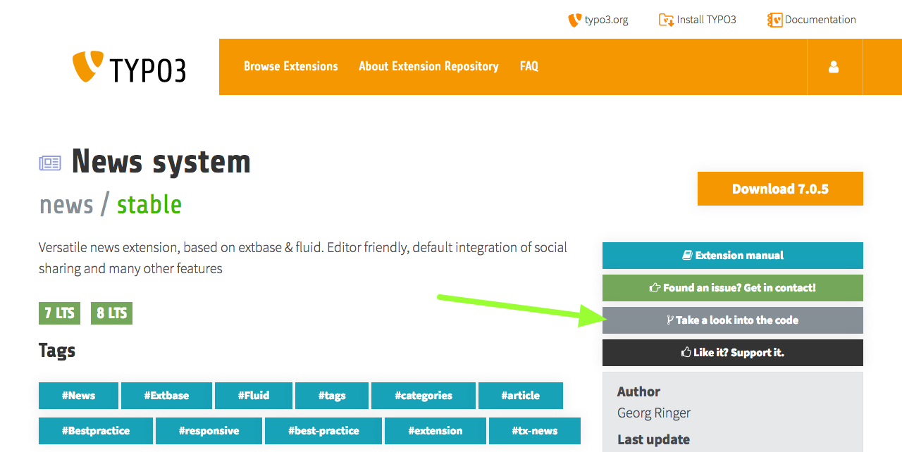
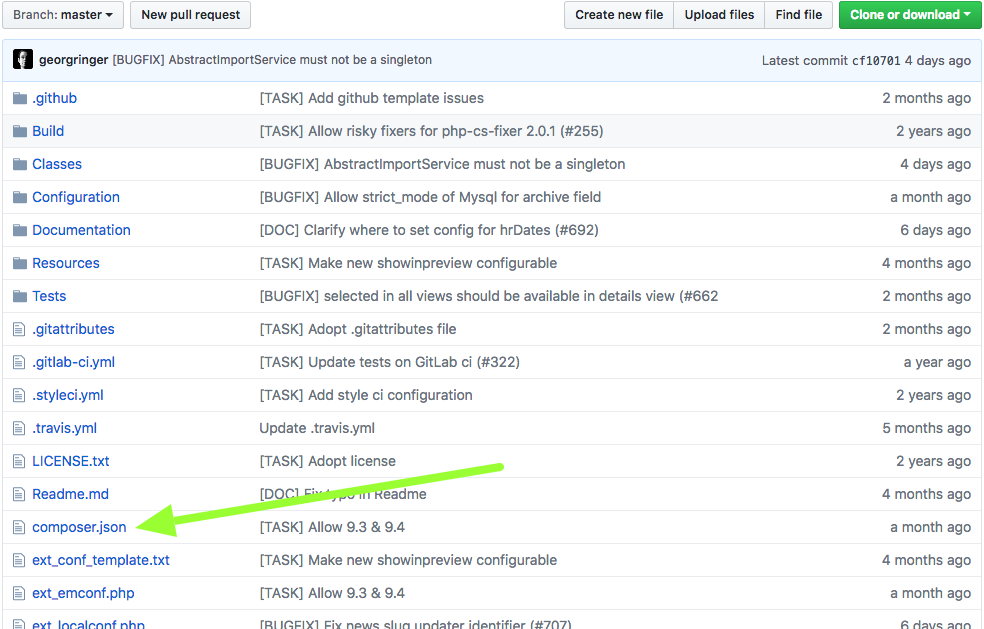
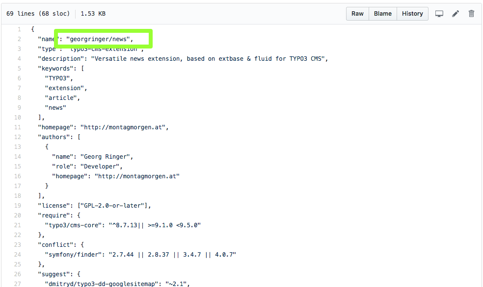
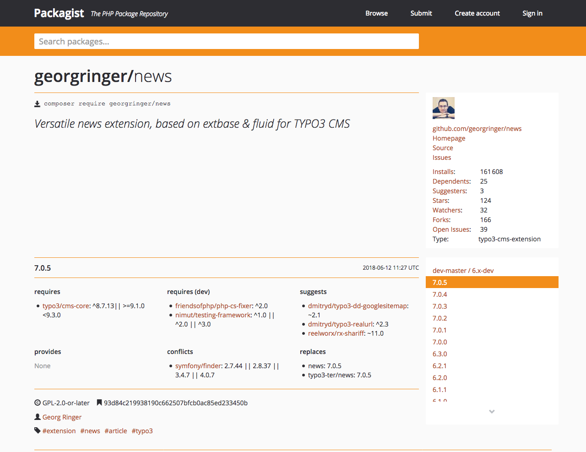

# Convert your TYPO3 project from non-composer to composer

## Requirements

### TYPO3 version

TYPO3 composer packages on [packagist.org](https://packagist.org) can be found down to version 6.2.0: [typo3/cms](https://packagist.org/packages/typo3/cms)

### Composer

Of course, you need `composer`. It's a program, written in PHP. Because you already use TYPO3, you should know how to install PHP. Instructions how to download and install `composer` can be found on <https://getcomposer.org>.

### Folder structure

If your project root folder is identical to your web root folder, you must change that.

**Bad:**

```
/
  index.php
  fileadmin/
  typo3/
  typo3conf/
  typo3temp/
```

You need a web root folder inside your project. You can find many tutorials with different names for your web root folder. The truth is: the name does not matter, because we can configure it in the settings in a later step. I will use `web` in my example, because it's a very common name on many systems.

**Good:**

```
/
  web/
    index.php
    fileadmin/
    typo3/
    typo3conf/
    typo3temp/
```

If you do not have such a web root directory, you must refactor your project before continuing.

### Code integrity

Your project must have the TYPO3 core and all installed extensions in original state. If you changed files, like templates or configurations directly in core or the extensions, you have a problem. That's not how TYPO3 works.

# Migration steps

## Delete files

Yes, that's true. You have to delete some files, because they will be created by composer in some of the next steps.

You have to delete, `web/index.php`, `web/typo3/` and all the extensions inside `web/typo3conf/ext/`, you downloaded from TER or any other resources like GitHub. You even have to delete your own extensions, if they are available in a separate Git repository and, for example, included as Git submodule.  
Pleas keep only your sitepackage extension or any other extension, which was explicitly  built for your current project and does not have an own Git repository.  

## Configure composer

Create a file with name `composer.json` in your project root, not inside yor web root. At the moment, only these few lines are required:

```json
{
    "repositories": [
        {
            "type": "composer",
            "url": "https://composer.typo3.org/"
        }
    ],
    "extra": {
        "typo3/cms": {
            "cms-package-dir": "{$vendor-dir}/typo3/cms",
            "web-dir": "web"
        }
    }
}
```

You must set the correct name of your web root folder in property `web-dir`.

## Add all required packages to your project

You can add all your required packages with the composer command `composer require`. The full syntax is:

```
composer require anyvendorname/anypackagename:version
```

Example:

```
composer require typo3/cms:~7.6.0
```

There are different ways to define the version of the package, you want to install. The most common syntaxes are start with `^` (e.g. `^7.6`) or with `~` (e.g. `~7.6.0`). A full documentation can be found at <https://getcomposer.org/doc/articles/versions.md>  

In short:

* `^7.6` or `^7.6.0` tells composer to add newest package of version 7.* with at least 7.6.0, but not version 8
* `~7.6.0` tells composer to add the package newest pack of version 7.6.* with at least 7.6.0, but not version 7.7

You have to decide by yourself, which syntax fits better to your needs.

### Install the core

#### The old way: add everything

As already written above, the line to install TYPO3 7 LTS would be:

```
composer require typo3/cms:~7.6.0
```

While installing TYPO3 8 LTS works with this line:

```
composer require typo3/cms:~8.7.0
```
#### The new way: add only code, you need

Since TYPO3 8.7.10 you *can* use a concept, called "subtree split". It will be *mandatory* for TYPO3 9. The concept means, you will not copy the full TYPO3 core package, including all system extensions, you will never use. But only install what you really want. You will not be able to install `typo3/cms:^9`, but have to name each system extension:

``` 
composer require typo3/cms-core:~9.0.0
composer require typo3/cms-backend:~9.0.0
composer require typo3/cms-frontend:~9.0.0
composer require ... 
```

Or in one line:

``` 
composer require typo3/cms-core:~9.0.0 typo3/cms-backend:~9.0.0 typo3/cms-frontend:~9.0.0 ... 
```

To find the correct package names, you can either take a look in the `composer.json` of any system extension or follow the naming convention `typo3/cms-<extension name with dash "-" instead of underscore "_">`, e.g. `typo3/cms-fluid-styled-content`.

### Install extensions from packagist.org

You already know the TER and always used it to install extensions? Fine. But with composer, the **prefered way** is to install extensions directly from there. This works great, when the maintainer uploaded them to packagist. Many well known extensions are already available there. You only need to known the package name. And here is a way to find it:

1. Search and open the extension, you want to install, in [TER](https://extensions.typo3.org)
2. Click button "Take a look into the code"  

3. Open file `composer.json`  

4. Search for line with property `"name"`, it's value should be formatted like `vendor/package`  

5. Check, if the package can be found on [packagist.org](https://packagist.org)  


**Example:**  
To install the news extension in version 7.0.*, type:

```
composer require georgringer/news:~7.0.0
```

### Install extension from TER

If the extension is not available on packagist, the good news is: All TER extensions are available via composer! That's, why we added `https://composer.typo3.org/` as repository to our `composer.json` some lines above. There are little naming conventions:

* Vendor name is `typo3-ter`
* Underscores `_` are replaced by dash `-`

**Example:**  
The well known extension `static_info_table`'s auto generated composer package name is `typo3-ter/static-info-tables`. To add this extension in version 6.5.*, type:

```
composer require typo3-ter/static-info-tables:~6.5.0
```

You can browse all available extensions and versions via <https://composer.typo3.org/satis.html>.

### Install extension from version control system (e.g. GitHub, Gitlab, ...)

In some cases, you will have to install an TYPO3 extension, which is not available on packagist.org or in the TER. Examples could be:

* non-public extension only used by your company
* you forked and modified an existing extension

As first step, you have to define the repository in your `composer.json`'s "repository" section. In this example, you find the additional lines added to the `composer.json` from above:

```json
{
    "repositories": [
        {
            "type": "composer",
            "url": "https://composer.typo3.org/"
        },
        {
            "type": "vcs",
            "url": "https://github.com/foo/bar.git"
        }
    ],
    "extra": {
        "typo3/cms": {
            "cms-package-dir": "{$vendor-dir}/typo3/cms",
            "web-dir": "web"
        }
    }
}
```

The Git repository must be a TYPO3 extension, with all the required files (e.g. `ext_emconf.php`) and must contain a valid `composer.json` itsself. How this file should look in your extension, can be found on <https://composer.typo3.org/>. Please note, that Git tags are uses as version numbers. 

If you fullfill these requirements, you can add your extension in the same way like the other examples.

```
composer require foo/bar:~1.0.0
```

## Include individual extensions like sitepackages

It's not neccessary to move your project's sitepackage to a dedicated Git repository to re-include it in your project. You can keep the files in your main project (e.g. `web/typo3conf/my_sitepackage`). There is only one thing to do. Because TYPO3's autoload feature works differntly in composer based installations, you have to register your PHP class names in composer. This is very easy when you use PHP namespaces:

```json
    "autoload": {
        "psr-4": {
            "VendorName\\MySitepackage\\": "web/typo3conf/ext/my_sitepackage/Classes/",
            "VendorName\\AnyOtherExtension\\": "web/typo3conf/ext/any_other_extension/Classes/"
        }
    }
```

For extension without PHP namespaces, this section has to look a bit different. You can decide by yourself, if you want to list each PHP file manually or if composer should search for them inside a folder:

```json
    "autoload": {
        "classmap": [
            "web/typo3conf/ext/my_old_extension/pi1/",
            "web/typo3conf/ext/my_old_extension/pi2/class.tx_myoldextension_pi2.php"
        ]
    }
```

To complete our example `composer.json`, this would like this:

```json
{
    "repositories": [
        {
            "type": "composer",
            "url": "https://composer.typo3.org/"
        },
        {
            "type": "vcs",
            "url": "https://github.com/foo/bar.git"
        }
    ],
    "extra": {
        "typo3/cms": {
            "cms-package-dir": "{$vendor-dir}/typo3/cms",
            "web-dir": "web"
        }
    },
    "autoload": {
        "psr-4": {
            "VendorName\\MySitepackage\\": "web/typo3conf/ext/my_sitepackage/Classes/"
            "VendorName\\AnyOtherExtension\\": "web/typo3conf/ext/any_other_extension/Classes/"
        },
        "classmap": [
            "web/typo3conf/ext/my_old_extension/pi1/",
            "web/typo3conf/ext/my_old_extension/pi2/class.tx_myoldextension_pi2.php"
        ]
    }
}
```

# Co-working

## Add to version conrol system

If you use a version control system like Git, it's important to add both files, the `composer.json` and `composer.lock` (which automatically was created during the previous steps).  
On the other side, some files and folders, which are added by composer, should be ecluded:

* `web/index.php`
* `web/typo3/`
* `vendor/`
* The extensions, you added via composer

A `.gitignore` file could look like this:

```
/vendor/*
/web/index.php
/web/typo3/*
/web/typo3conf/ext/*
# allow some extensions
!/web/typo3conf/ext/my_sitepackage/
!/web/typo3conf/ext/prefix_*
``` 

## Checkout from version control system

All your co-workers should always run `composer install` after they checked out the files. This command will install the packages and versions, defined in `composer.lock`. So you and your co-workers always can be sure to have installed the same versions of the TYPO3 core and the extensions.

# Best practices

## Run composer locally

You should not run composer on your live webspace. You always should run composer on your local machine, so you can test if everything worked fine. After running your tests, you can deploy the `vendor` and `web` folder you your webserver.

To avoid conflicts between your local and your server's PHP version, you can define your server's PHP version in your `composer.json` file (e.g. `{"platform": {"php": "7.2"}}`), so composer will always check the correct dependencies. 

## Update packages

After updating any packages, you always should commit your `composer.lock` to your version control system and your co-workers should run `composer install` after checking out the updates.

### Update all packages

Run `composer update` without any other attributes, to update all packages. Composer will always try to install the newest packages that match the defined version constraints.

## Update single packages

When you want to update single packages, you can call the `update` command with the package name. You should alway add `--with-dependencies` attribute to also update the required third party packages. 

#### Update TYPO3 core 

**Without "subtree split"**

```
composer update typo3/cms --with-dependencies
```

**With "subtree split"**

```
composer update typo3/cms-* --with-dependencies
```

#### Update extensions like "news" 

```
composer update georgringer/news --with-dependencies
```

### Use "dev requirements"

Add packages with `--dev` attribute to add packages only to your local development environment. This is very usefull for packages, you do not need or do not want to have on your live server, e.g. PHPUnit or Testing-Frameworks:

```
composer require typo3/testing-framework:^2.0 --dev
``` 

During your deployment routine, you should run `composer install` with attribute `--no-dev`. So the dev requirements are not installed.

```
composer install --no-dev
```

### Remove extensions

You can use the composer command `remove` to uninstall extensions or other composer packages.

```
composer remove georgringer/news 
```

Don't forget to commit your updated `composer.lock` to your version control system.

### Check for available updates

Run `composer outdated` to see a list of available updates.

### Simplify "subtree split" installations

Instead of explicitly requiring each core extension, you can require [typo3/minimal](https://packagist.org/packages/typo3/minimal), which brings the minial required set of stystem extensions.